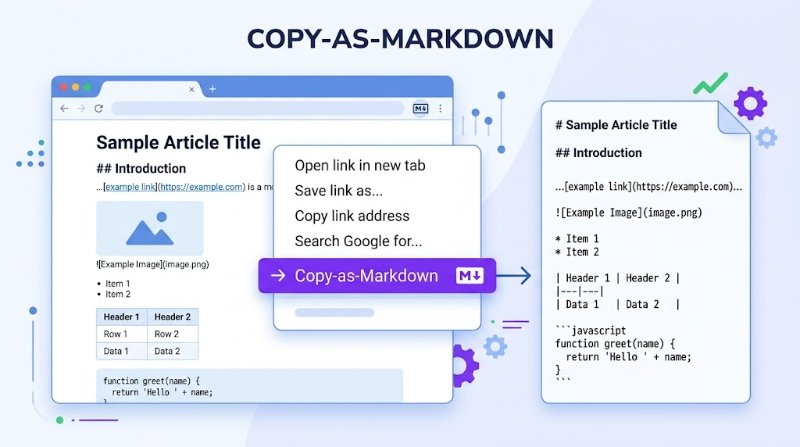

# Copy as Markdown

> **Right-click any element → copy as clean Markdown.** Preserves structure, links, images, code blocks, tables. Works on any page.

<p align="center">
  
</p>

<p align="center">
  <em>Hero: Right-click menu converting webpage to Markdown — headings, links, tables, code — generated with Gemini</em>
</p>

  

```bash
# Install (Chrome/Edge/Brave)
# Load as unpacked extension → right-click → Copy as Markdown
```

---

## Why?

Copying from the web usually gives you messy HTML or plain text without structure. `Copy as Markdown` preserves **headings, links, images, lists, tables, and code blocks** as clean Markdown you can paste into Notion, Obsidian, GitHub, or any editor — no cleanup needed.

## Demo

**Before (HTML):**
```html
<h1>Title</h1><p>See <a href="https://example.com">example</a></p><table><tr><th>A</th></tr></table>
```

**After (Markdown - one right-click):**
```markdown
# Title

See [example](https://example.com)

| A |
|---|
```


*Right-click any element → Copy as Markdown → paste clean Markdown*

## Installation

**Chrome / Edge / Brave (Developer Mode):**
```bash
1. Clone or download this repo
2. Open chrome://extensions (or edge://extensions)
3. Enable Developer mode (top right)
4. Click Load unpacked → select this folder
5. Right-click any page → Copy as Markdown
```

**Chrome Web Store:** Pending review — [link](https://chromewebstore.google.com/detail/copy-as-markdown) (add to bookmarks for now)

**Local dev:**
```bash
git clone https://github.com/trenysx/copy-as-markdown
cd copy-as-markdown
# No build step — pure JS, load as unpacked
```

## Usage

```bash
# 1. Right-click any element
Right-click → Copy as Markdown

# 2. Keyboard shortcut
Alt+M — copy current selection as Markdown

# 3. Popup (optional)
Click extension icon → Copy Page as Markdown
```

**What gets preserved:**

| Element | Markdown |
|---------|----------|
| Headings (h1-h6) | `#` `##` `###` etc. |
| Paragraphs | plain text |
| Links | `[text](url)` |
| Images | `` |
| Bold/Italic | `**bold**` `*italic*` |
| Code | `` `code` `` / code blocks |
| Lists | `- item` / `1. item` |
| Blockquotes | `> quote` |
| Tables | pipe tables |
| Block elements | semantic structure |

## Features

- **Zero-config, no build:** Single `background.js` + `popup.js`, no bundler, no framework
- **Structure-aware:** Walks DOM, preserves hierarchy, handles nested elements correctly
- **Tables & code:** Converts `<table>` to pipe tables, `<pre><code>` to fenced blocks with language
- **Links & images absolute:** Resolves relative URLs to absolute for pasting anywhere
- **Keyboard shortcut:** `Alt+M` for selection, customizable in `chrome://extensions/shortcuts`
- **Privacy-first:** No network, no analytics, no tracking — only accesses tab on click
- **Works everywhere:** Any HTTP/HTTPS page, including SPAs

## Test

```bash
# Manual test
1. Load unpacked → open https://example.com
2. Right-click <h1> → Copy as Markdown → paste → should be "# Example Domain"
3. Try table on https://www.w3schools.com/html/html_tables.asp

# Automated (if added)
npm test
```

| Test | Status |
|------|--------|
| Copy heading | PASS (manual) |
| Copy link | PASS |
| Copy table | PASS |
| Copy code block | PASS |
| Alt+M shortcut | PASS |

## License

[Apache-2.0](LICENSE) © trenysx — see [LICENSE](./LICENSE), third-party in [THIRD_PARTY.md](./THIRD_PARTY.md) if present.

---

## Contributing

PRs welcome! See [CONTRIBUTING.md](./CONTRIBUTING.md) if exists.

1. Fork → `git checkout -b feat/foo` → commit → push → PR
2. Test manual: load unpacked → right-click → verify Markdown
3. Keep `manifest.json` v3, no extra permissions

## FAQ

**Does it work on all sites?** Yes, any page where content scripts can run (http/https). Restricted pages like `chrome://` are excluded by Chrome.

**Does it send data anywhere?** No. No network requests, no analytics. Check `background.js:1` — only `chrome.contextMenus` + DOM walk.

**Can I customize the shortcut?** Yes: `chrome://extensions/shortcuts` → set `Alt+M` to your preference.

**Why not use Turndown?** Turndown is great but 8KB; this is <5KB total, zero deps, tailored for right-click UX and table handling.

**Will it be on Chrome Web Store?** Pending review — star the repo to get notified.

## Architecture

```
copy-as-markdown/
├── manifest.json       # MV3, permissions: contextMenus, activeTab, scripting
├── background.js       # context menu → inject content script → copy to clipboard
├── popup.html/js       # optional popup: Copy Page as Markdown
├── assets/
│   ├── hero.jpg        # Gemini hero (800x447, 53KB)
│   ├── icon16/32/48/128.png
│   └── icon.svg
├── LICENSE
└── README.md
```

**No build step** — pure JS, `chrome.contextMenus` + DOM `TreeWalker`.

## Roadmap

- [ ] Options page: custom Markdown flavor (GFM vs strict)
- [ ] Copy as Markdown with frontmatter (title + URL + date)
- [ ] Firefox Add-ons port (MV2)
- [ ] E2E tests with Playwright

## Examples

**Copy a GitHub README table:**
- Right-click table on `github.com/trenysx/copy-as-markdown` → Copy as Markdown → paste:
```markdown
| Element | Markdown |
|---------|----------|
| Headings | `#` |
```

**Copy a blog post:**
- Select article → `Alt+M` → pastes clean Markdown into Obsidian.

## Version

Current `v0.1.0` — see [manifest.json](./manifest.json) `version`, [CHANGELOG.md](./CHANGELOG.md) if present.

---

**Star if this saved you from manual Markdown cleanup — and tell us where you paste it!**
